# My Singing Monsters Egg Reference

A quick visual reference for identifying the two parent monster icons currently sitting in a breeding structure.

<table class="msm-eggs">
	<thead>
		<tr>
			<th>Monster</th>
			<th>Egg</th>
			<th>Visual Description</th>
			<th>Standard Time</th>
			<th>Enhanced Time</th>
		</tr>
	</thead>
	<tbody>
		<tr>
			<td class="monster">Noggin</td>
			<td class="egg"></td>
			<td>Small gray stone-like egg with dark cracks and a simple rocky Earth-element look.</td>
			<td class="time">5s</td>
			<td class="time">3s</td>
		</tr>
		<tr>
			<td class="monster">Mammott</td>
			<td class="egg"></td>
			<td>White/gray fuzzy egg with icy blue shading and a simple Cold-element look.</td>
			<td class="time">2m</td>
			<td class="time">1m 30s</td>
		</tr>
		<tr>
			<td class="monster">Toe Jammer</td>
			<td class="egg">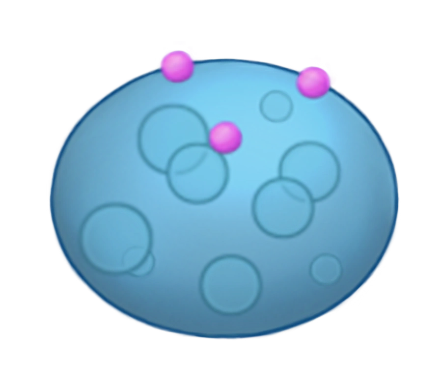</td>
			<td>Blue aquatic egg with a wet, round look and soft water-element coloring.</td>
			<td class="time">1m</td>
			<td class="time">45s</td>
		</tr>
		<tr>
			<td class="monster">Potbelly</td>
			<td class="egg">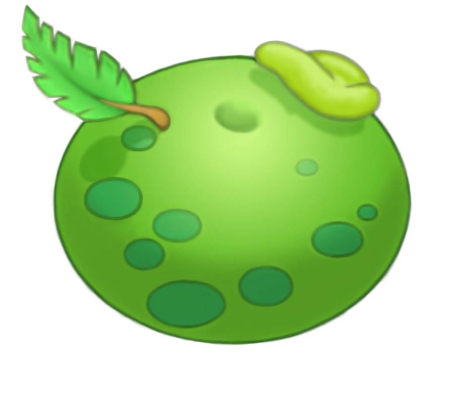</td>
			<td>Green plant egg with leafy sprout details and a simple Plant-element look.</td>
			<td class="time">2h</td>
			<td class="time">1h 30m</td>
		</tr>
		<tr>
			<td class="monster">Tweedle</td>
			<td class="egg"></td>
			<td>Air-element egg with pale coloring and feather/bird-like visual details.</td>
			<td class="time">4h</td>
			<td class="time">3h</td>
		</tr>
		<tr>
			<td class="monster">Maw</td>
			<td class="egg">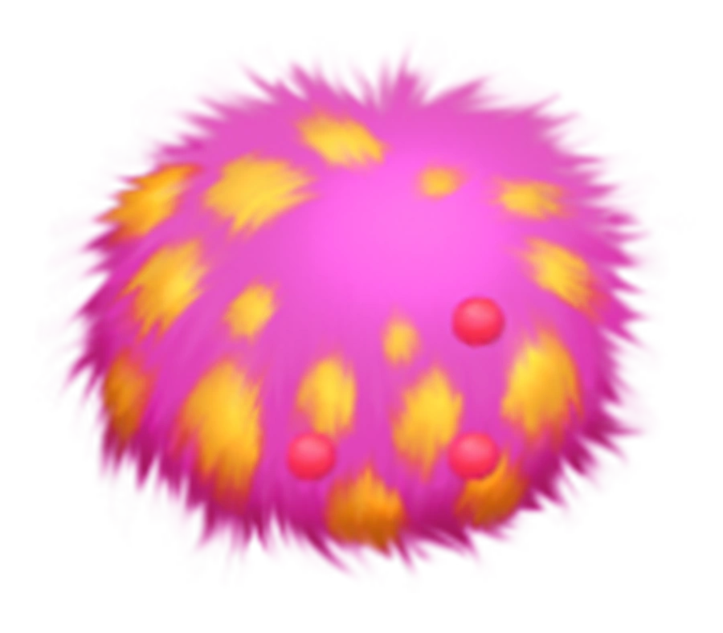</td>
			<td>Bright fuzzy pink/magenta egg with yellow-orange patches and small red bead-like bumps.</td>
			<td class="time">30m</td>
			<td class="time">22m 30s</td>
		</tr>
		<tr>
			<td class="monster">Drumpler</td>
			<td class="egg">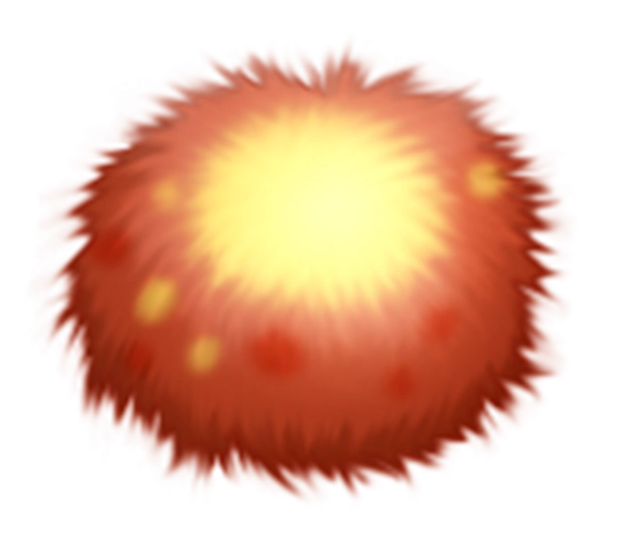</td>
			<td>Red-orange fuzzy egg with a bright yellow center glow and small yellow spots.</td>
			<td class="time">30m</td>
			<td class="time">22m 30s</td>
		</tr>
		<tr>
			<td class="monster">Fwog</td>
			<td class="egg">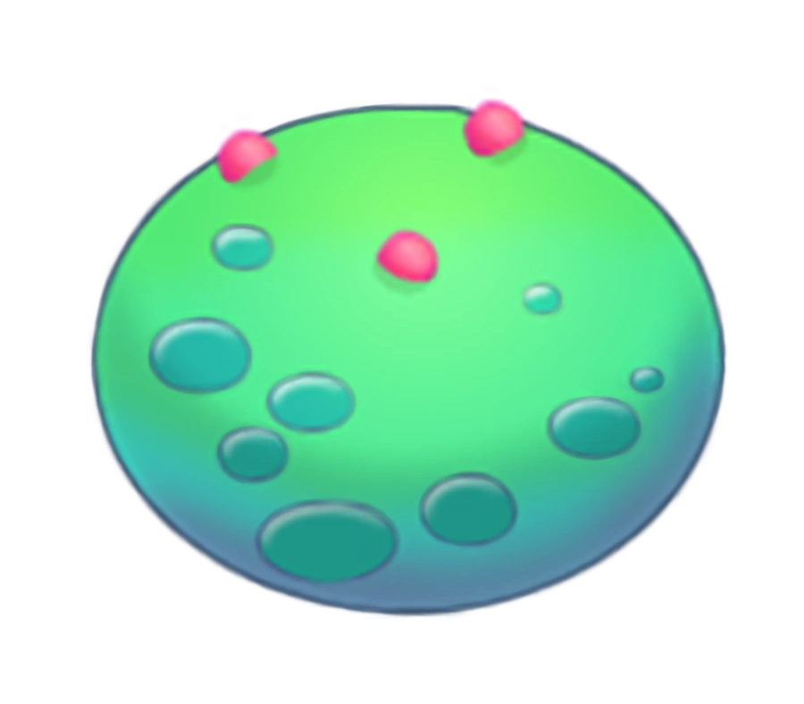</td>
			<td>Bright green-blue smooth egg with teal spots and small pink nubs on top.</td>
			<td class="time">30m</td>
			<td class="time">22m 30s</td>
		</tr>
		<tr>
			<td class="monster">Furcorn</td>
			<td class="egg">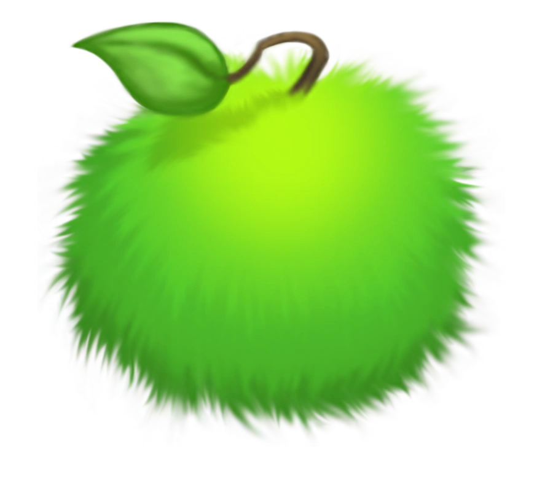</td>
			<td>Lime-green fuzzy egg with a leaf and curled brown stem on top.</td>
			<td class="time">8h</td>
			<td class="time">6h</td>
		</tr>
		<tr>
			<td class="monster">Oaktopus</td>
			<td class="egg"></td>
			<td>Yellow-green smooth egg with leafy sprout cluster and curled brown stem on top.</td>
			<td class="time">8h</td>
			<td class="time">6h</td>
		</tr>
		<tr>
			<td class="monster">Shrubb</td>
			<td class="egg">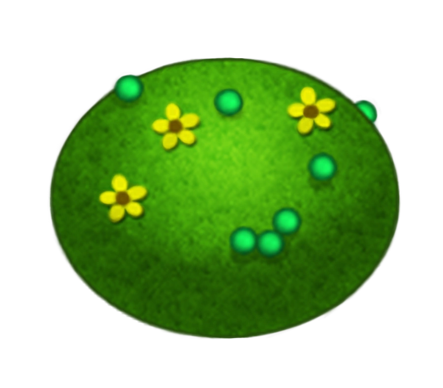</td>
			<td>Dark green plant-like egg with yellow flowers and round teal-green bumps.</td>
			<td class="time">8h</td>
			<td class="time">6h</td>
		</tr>
		<tr>
			<td class="monster">Pango</td>
			<td class="egg"></td>
			<td>Dark purple fuzzy egg with white patches and a large red scarf wrapped across it.</td>
			<td class="time">8h</td>
			<td class="time">6h</td>
		</tr>
		<tr>
			<td class="monster">Quibble</td>
			<td class="egg">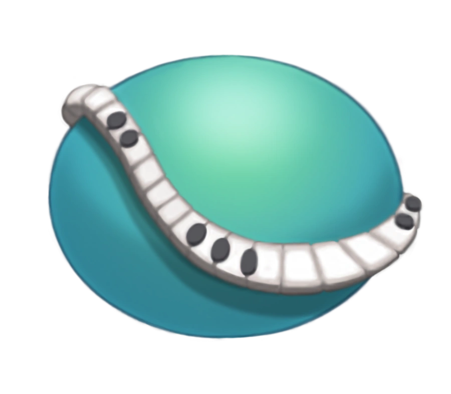</td>
			<td>Pale blue egg with purple spots and two orange feather tufts on top.</td>
			<td class="time">8h</td>
			<td class="time">6h</td>
		</tr>
		<tr>
			<td class="monster">Dandidoo</td>
			<td class="egg">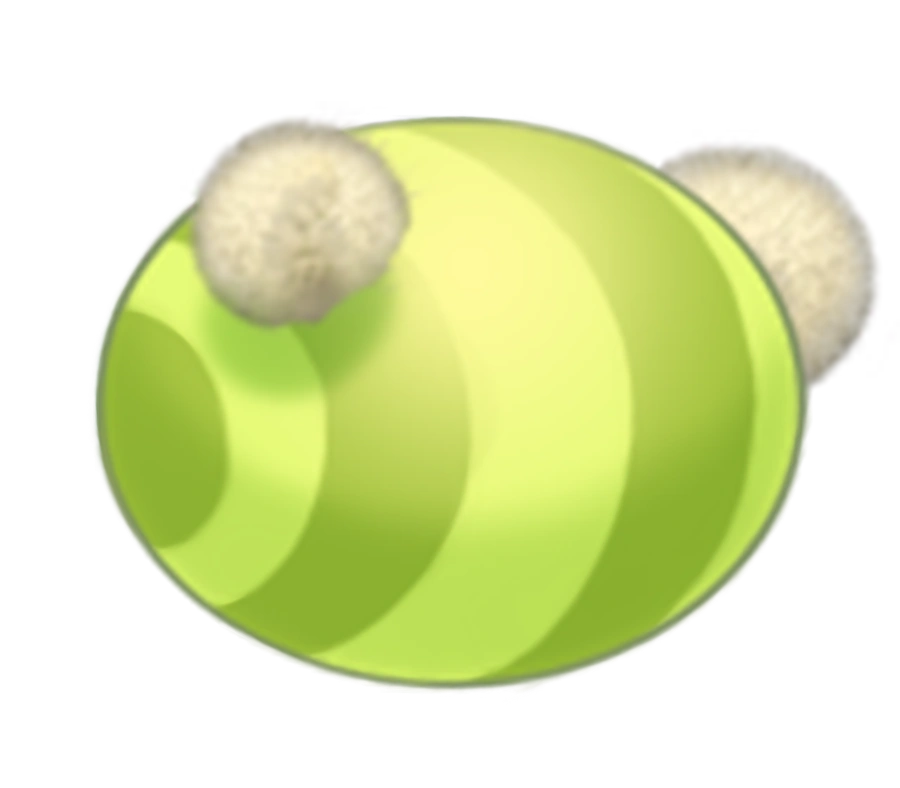</td>
			<td>Light, airy plant/air egg with feathered or tufted details; softer than Cybop and more delicate than Tweedle.</td>
			<td class="time">8h</td>
			<td class="time">6h</td>
		</tr>
		<tr>
			<td class="monster">Cybop</td>
			<td class="egg">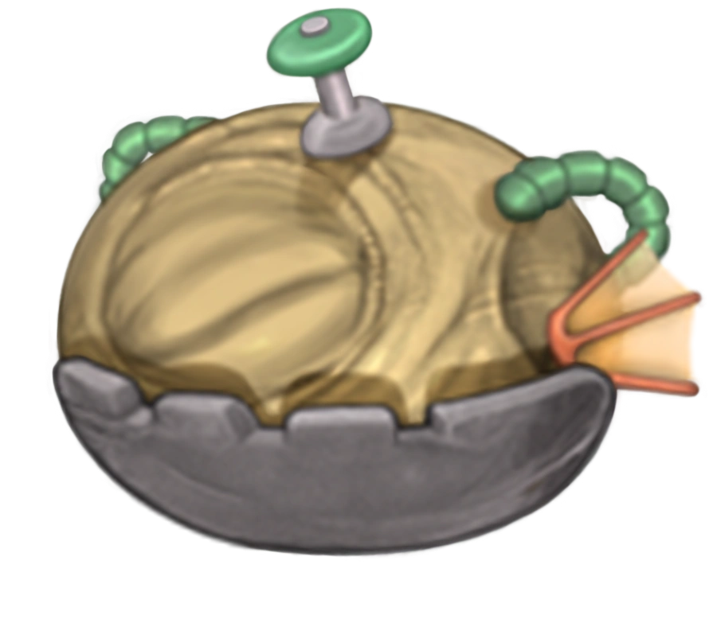</td>
			<td>Mechanical-looking air/earth egg with a more constructed, gadget-like silhouette than the soft fuzzy eggs.</td>
			<td class="time">8h</td>
			<td class="time">6h</td>
		</tr>
		<tr>
			<td class="monster">T-Rox</td>
			<td class="egg"></td>
			<td>Gray cracked stone egg with blue crystal spikes and a yellow jaw-like plate.</td>
			<td class="time">8h</td>
			<td class="time">6h</td>
		</tr>
		<tr>
			<td class="monster">Bowgart</td>
			<td class="egg">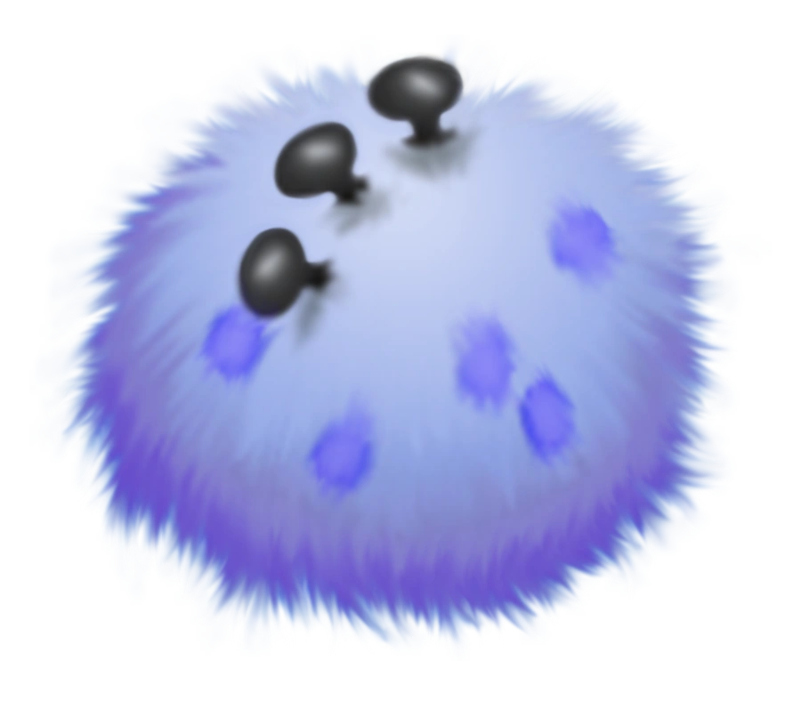</td>
			<td>Blue fuzzy egg with purple patches, a single large eye-like circle, and an ice shard on top.</td>
			<td class="time">12h</td>
			<td class="time">9h</td>
		</tr>
		<tr>
			<td class="monster">Clamble</td>
			<td class="egg">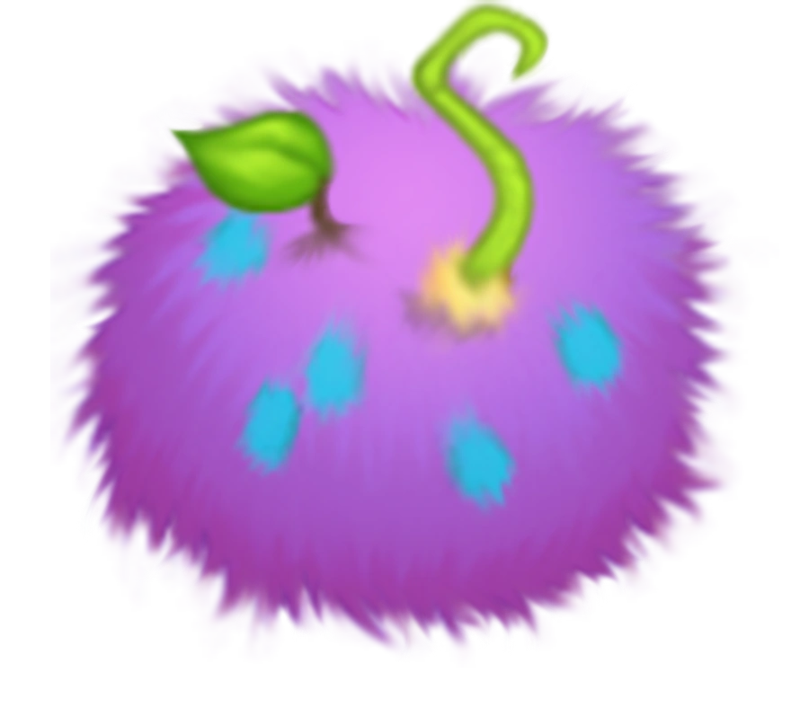</td>
			<td>Plant/earth/cold egg with a heavier, armored or plate-like look compared with Furcorn and Drumpler.</td>
			<td class="time">12h</td>
			<td class="time">9h</td>
		</tr>
		<tr>
			<td class="monster">Pummel</td>
			<td class="egg">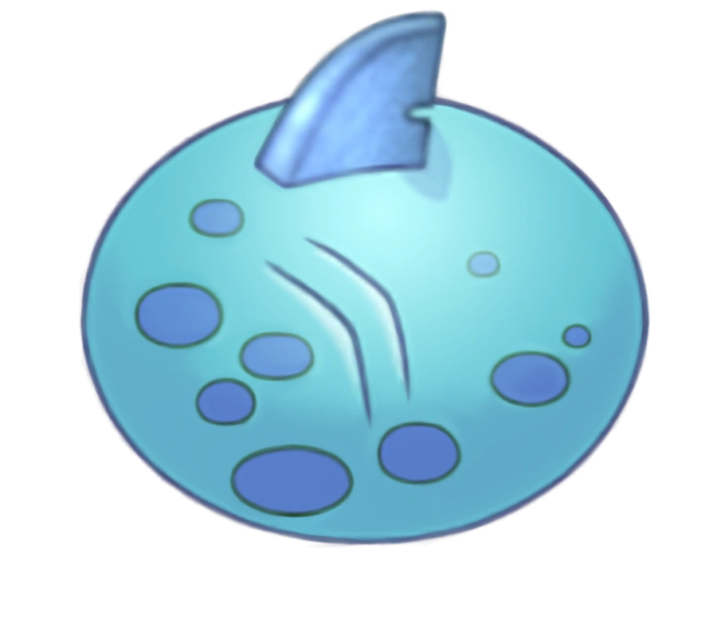</td>
			<td>Turquoise-blue egg with blue spots, scratch marks, and a shark-fin-like blue spike.</td>
			<td class="time">12h</td>
			<td class="time">9h</td>
		</tr>
		<tr>
			<td class="monster">Congle</td>
			<td class="egg">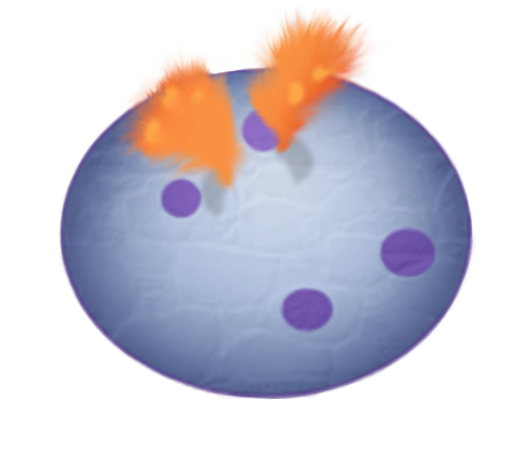</td>
			<td>Pale blue egg with purple spots and two orange fuzzy tufts on top.</td>
			<td class="time">12h</td>
			<td class="time">9h</td>
		</tr>
		<tr>
			<td class="monster">Spunge</td>
			<td class="egg">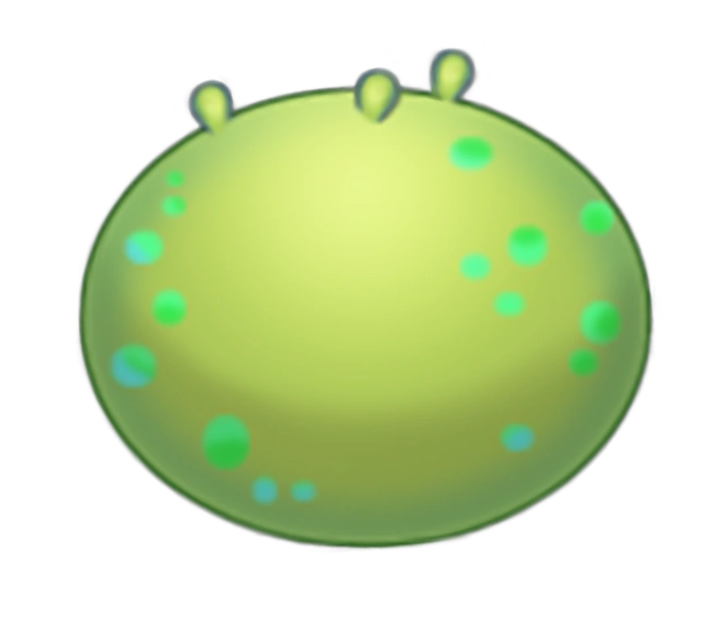</td>
			<td>Light green egg with teal dots and small dark-tipped antennae/nubs on top.</td>
			<td class="time">12h</td>
			<td class="time">9h</td>
		</tr>
		<tr>
			<td class="monster">Thumpies</td>
			<td class="egg">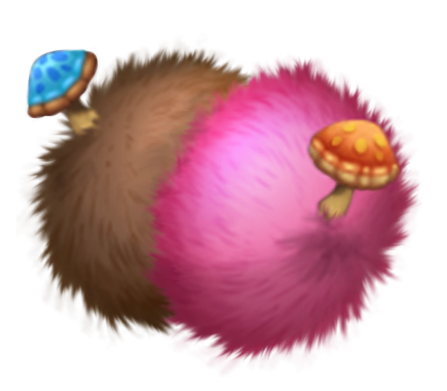</td>
			<td>Half brown, half hot-pink fuzzy egg with small mushroom caps growing from it.</td>
			<td class="time">12h</td>
			<td class="time">9h</td>
		</tr>
		<tr>
			<td class="monster">Reedling</td>
			<td class="egg">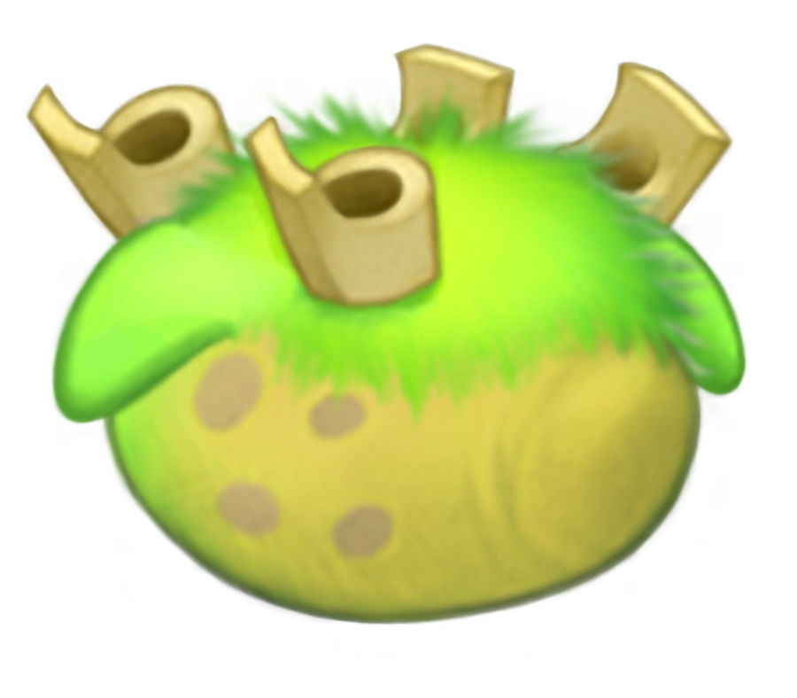</td>
			<td>Earth/plant/air egg with reed or pipe-like visual language; more vertical/detail-heavy than Shrubb or Cybop.</td>
			<td class="time">12h</td>
			<td class="time">9h</td>
		</tr>
		<tr>
			<td class="monster">Scups</td>
			<td class="egg">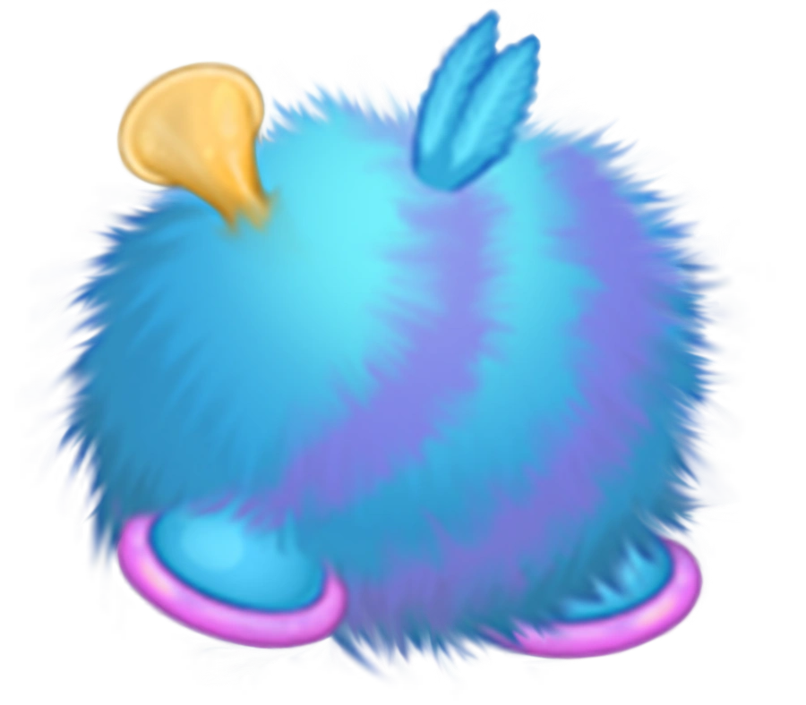</td>
			<td>Water/earth/air egg with rounded aquatic details and a more complex blue/earthy look than Fwog.</td>
			<td class="time">12h</td>
			<td class="time">9h</td>
		</tr>
		<tr>
			<td class="monster">PomPom</td>
			<td class="egg">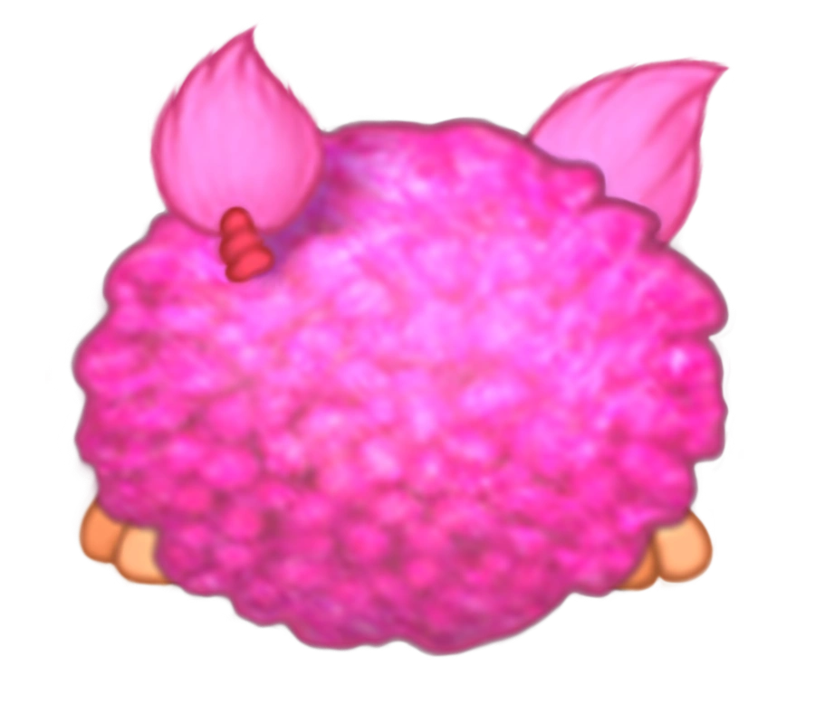</td>
			<td>Cold/earth/air egg with bright, cheer-like fuzzy styling; visually busier than Pango or Drumpler.</td>
			<td class="time">12h</td>
			<td class="time">9h</td>
		</tr>
		<tr>
			<td class="monster">Entbrat</td>
			<td class="egg">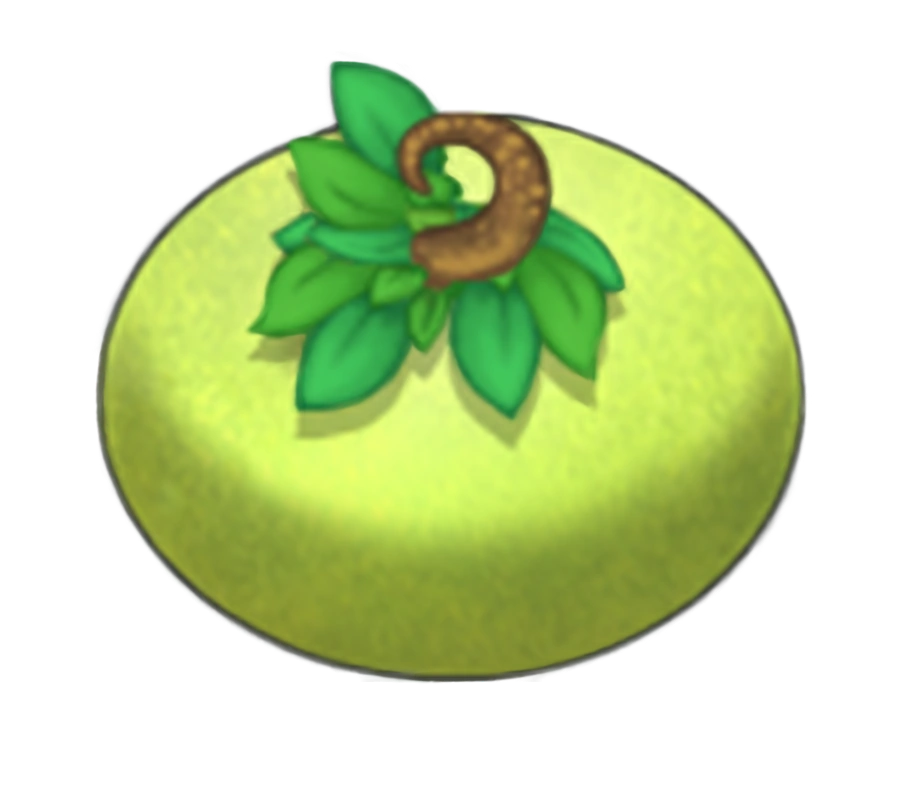</td>
			<td>Green textured egg with leafy top and tan horn-like spikes.</td>
			<td class="time">1d</td>
			<td class="time">18h</td>
		</tr>
		<tr>
			<td class="monster">Deedge</td>
			<td class="egg">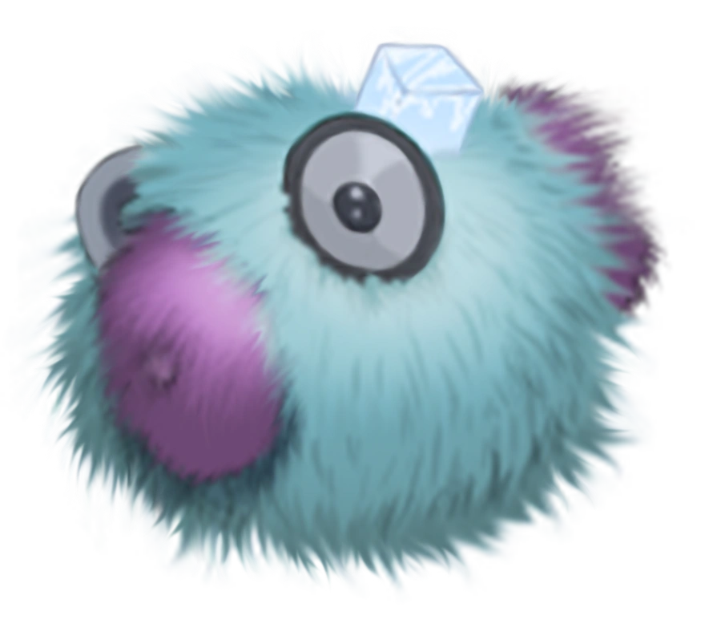</td>
			<td>Large icy blue fuzzy egg with purple patches, black knobs, and frosty coloring.</td>
			<td class="time">1d</td>
			<td class="time">18h</td>
		</tr>
		<tr>
			<td class="monster">Riff</td>
			<td class="egg">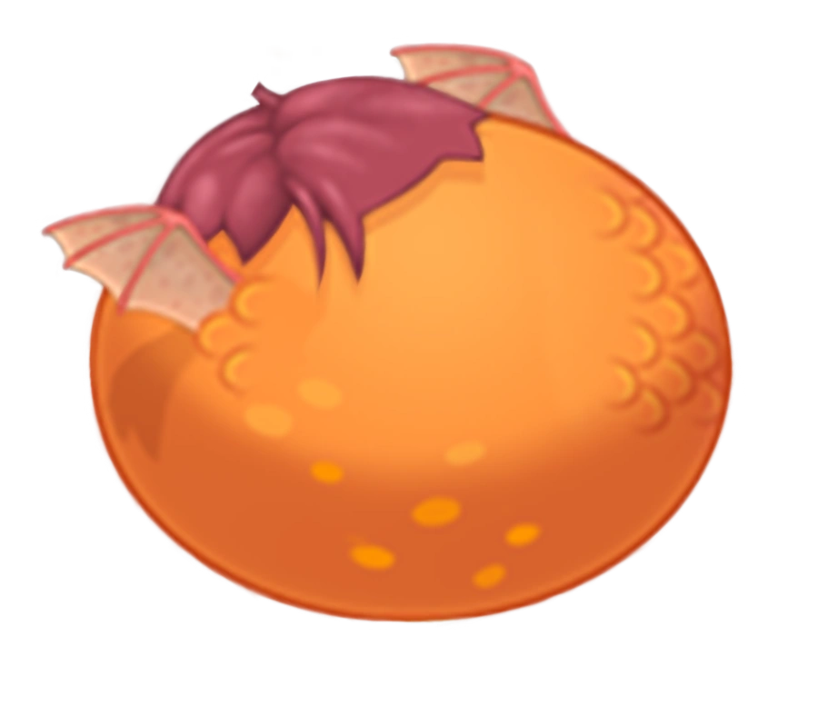</td>
			<td>Orange egg with wing-like fins, reddish top tuft, and small yellow spots.</td>
			<td class="time">1d</td>
			<td class="time">18h</td>
		</tr>
		<tr>
			<td class="monster">Shellbeat</td>
			<td class="egg">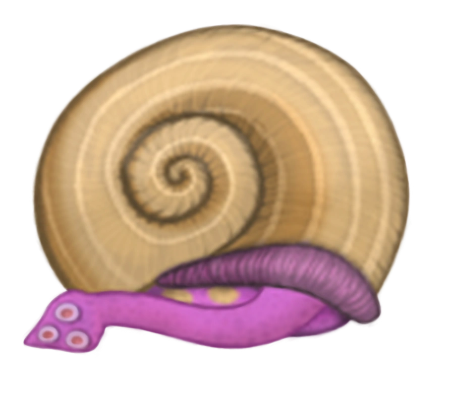</td>
			<td>Snail-shell style egg with a tan spiral shell and purple body-like lower section.</td>
			<td class="time">1d</td>
			<td class="time">18h</td>
		</tr>
		<tr>
			<td class="monster">Quarrister</td>
			<td class="egg">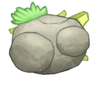</td>
			<td>Small gray rock cluster egg with green grass/sprouts peeking out.</td>
			<td class="time">1d</td>
			<td class="time">18h</td>
		</tr>
	</tbody>
</table>

## Scope

This reference covers the 30 Natural monsters used across the core Natural islands: **Plant**, **Cold**, **Air**, **Water**, and **Earth**.

It does not include Fire, Magical, Ethereal, Mythical, Seasonal, Rare, or Epic variants.

## Quick Timer Groups

- **Single-element Natural monsters:** from seconds up to a few hours, depending on the monster.
- **Fast two-element Naturals:** **Maw**, **Drumpler**, and **Fwog** are **30m** standard / **22m 30s** enhanced.
- **Most two-element Naturals:** **8h** standard / **6h** enhanced.
- **Three-element Naturals:** **12h** standard / **9h** enhanced.
- **Four-element quads:** **1d** standard / **18h** enhanced.

## Common Breeding Fails: 24-hour Natural Monsters

- **If the timer says `1d`, you bred a quad.**
- **If the enhanced timer says `18h`, same thing: quad fail.**
- Quad eggs in this reference:
	- **Entbrat** — Plant quad
	- **Deedge** — Cold quad
	- **Riff** — Air quad
	- **Shellbeat** — Water quad
	- **Quarrister** — Earth quad
