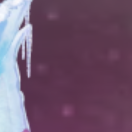
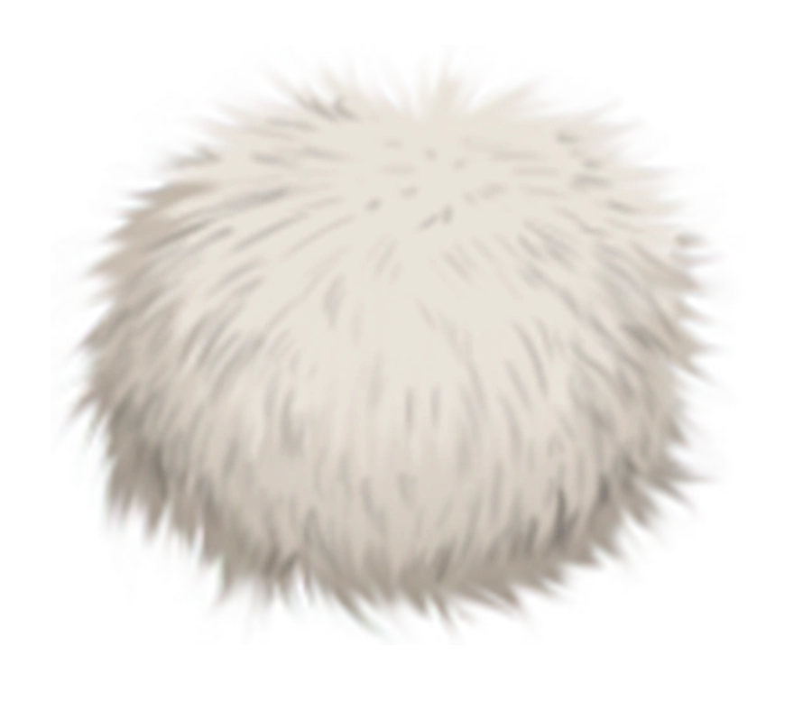
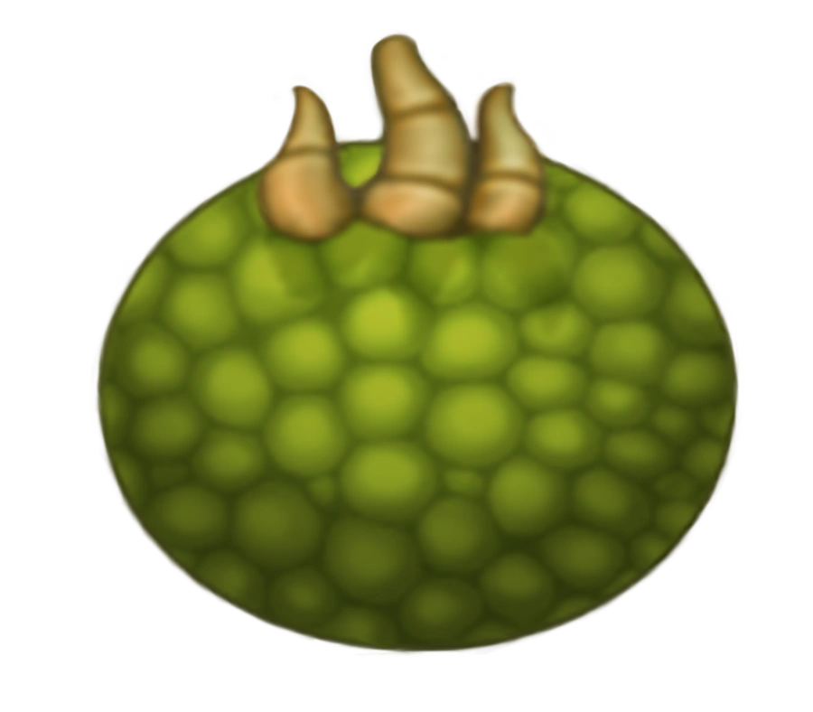
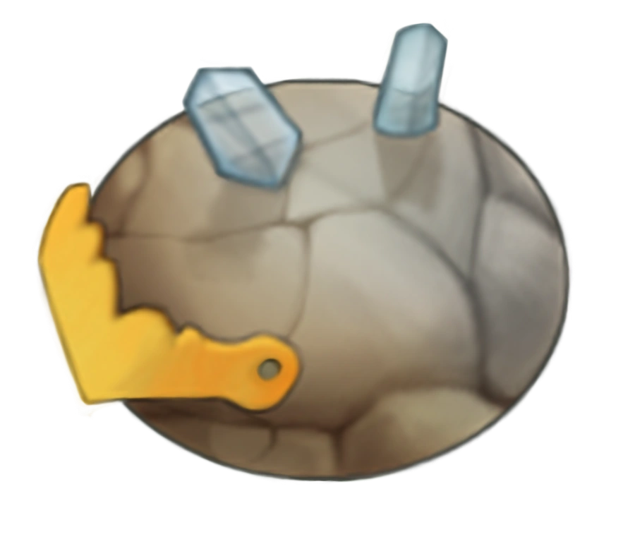
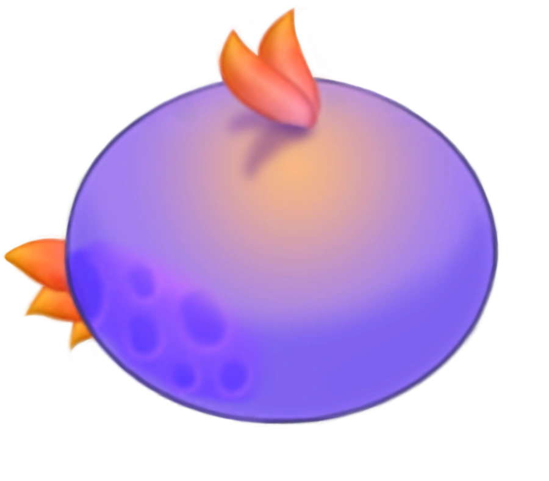

# Breeder Result Guess

## Source

Island: **Mirror Cold Island**  
Island alias: **Mirror Cold Island -> Cold Island**  
Detection mode: **detect-breeders**  

Source image: `training/screenshots/2026-07-09-world-overview-mirror-cold-island.png`


## Detector candidates

Active filters: locked templates excluded, Paironormal templates excluded, minimum size `120x120`, match threshold `0.720`.

Active templates: `enhanced-breeding-structure.webp, normal-breeding-structure.webp`

Rejected detector checks:

| Reason | Count |
|---|---:|
| paironormal_template_excluded | 48 |
| locked_template_excluded | 13 |
| below_min_size | 3 |
| below_threshold | 25 |

| Candidate | Template | Match score | Detector confidence | Template scale | Bounding box |
|---:|---|---:|---|---:|---|
| 1 | enhanced-breeding-structure.webp | 0.726 | low | 0.15 | `x=1830, y=310, w=132, h=132` |

Debug candidate shortlist:

| Rank | Template | Match score | Template scale | Bounding box |
|---:|---|---:|---:|---|
| 1 | enhanced-breeding-structure.webp | 0.726 | 0.15 | `x=1830, y=310, w=132, h=132` |

## Recognition notes

- When a Breeding Structure is in progress, the top-left and top-right eggs are the parent eggs.
- When a Breeding Structure is finished, the bottom-center egg is the resulting egg.
- Parent egg crop regions are currently heuristic and should be tuned from confirmed training examples.
- Automated egg-reference matching is a simple helper, not a trained recognizer and not authoritative.
- Manual parent recognition, when supplied, is displayed separately from automated matches.

## Candidate 1

Detector: `enhanced-breeding-structure.webp`, score `0.726`, confidence `low`, scale `0.15`

### Warnings

- The Breeding Structure detector confidence is low; candidate crop requires manual review.
- Manual `--parents` were supplied for this candidate.
- The final guess depends on manual parent recognition.
- The left automated egg-reference match disagrees with manual recognition: manual `Mammott`, automated `Oaktopus`.
- The right automated egg-reference match disagrees with manual recognition: manual `Tweedle`, automated `Pango`.

### Breeding Structure crop

Crop coordinates: `x=1830, y=310, w=132, h=132`



Upscaled evidence crop:


## Manual parent recognition

Manual parent recognition comes only from `--parents LEFT RIGHT` and currently applies to candidate 1 only.

Left manual parent: **Mammott**  
Right manual parent: **Tweedle**

## Automated egg-reference matches

Automated matching is non-authoritative evidence for review.

Left automated parent: **Oaktopus**  
Right automated parent: **Pango**

### Parent egg evidence

Left parent relative crop setting: `x=0.2, y=0.06, w=0.22, h=0.22`  
Right parent relative crop setting: `x=0.58, y=0.06, w=0.22, h=0.22`

### Left parent egg crop

Relative crop inside detected Breeding Structure: `x=0.2, y=0.06, w=0.22, h=0.22`

Resulting absolute crop box: `x=1856, y=318, w=29, h=29`

Crop clamping: **no**

Crop coordinates: `x=1856, y=318, w=29, h=29`


Upscaled evidence crop:


Manual parent: **Mammott**  

Manual parent reference egg:



Top automated match: **Oaktopus**

Automated egg-reference matches:

| Rank | Monster | Score | RMS | Reference |
|---:|---|---:|---:|---|
| 1 | Oaktopus | 87.1 | 56.99 |  |
| 2 | Pango | 86.7 | 58.76 |  |
| 3 | Noggin | 86.1 | 61.53 |  |
| 4 | Shrubb | 85.5 | 63.85 |  |
| 5 | T-Rox | 85.5 | 64.23 |  |

### Right parent egg crop

Relative crop inside detected Breeding Structure: `x=0.58, y=0.06, w=0.22, h=0.22`

Resulting absolute crop box: `x=1907, y=318, w=29, h=29`

Crop clamping: **no**

Crop coordinates: `x=1907, y=318, w=29, h=29`


Upscaled evidence crop:


Manual parent: **Tweedle**  

Manual parent reference egg:



Top automated match: **Pango**

Automated egg-reference matches:

| Rank | Monster | Score | RMS | Reference |
|---:|---|---:|---:|---|
| 1 | Pango | 89.4 | 46.80 |  |
| 2 | Oaktopus | 89.3 | 47.11 |  |
| 3 | Noggin | 88.1 | 52.54 |  |
| 4 | Cybop | 87.4 | 55.43 |  |
| 5 | Shrubb | 87.4 | 55.47 |  |

## Structured breeding lookup

```text
Island: Mirror Cold Island
Alias: Mirror Cold Island -> Cold Island
Parents used: Mammott + Tweedle
Left parent source: manual_parent_recognition
Right parent source: manual_parent_recognition
```

## Final guess

Likely result: **Pango**

Confidence: **high**

Reason:

- Mirror Cold Island aliases to Cold Island.
- Pango is listed for Cold Island.
- Pango's listed parent pair is Tweedle + Mammott.
- Standard time: 8h.
- Enhanced time: 6h.

## Training review

Suggested `detector_classification` values: `confirmed_positive`, `false_positive`, `missed_detection`, `parent_crop_incorrect`, `parent_crop_correct`, `unresolved`.

```yaml
training_review:
  status: reviewed
  detector_candidate_correct: false
  detector_classification: false_positive
  breeder_box_correction: null
  left_parent_crop_correct: false
  left_parent_box_correction: null
  right_parent_crop_correct: false
  right_parent_box_correction: null
  confirmed_left_parent: Mammott
  confirmed_right_parent: Tweedle
  confirmed_result: Pango
  notes: Lowered-threshold detector selected background or monster-edge texture, not a Breeding Structure. Parent egg crops are invalid because the breeder candidate itself is false.
```
