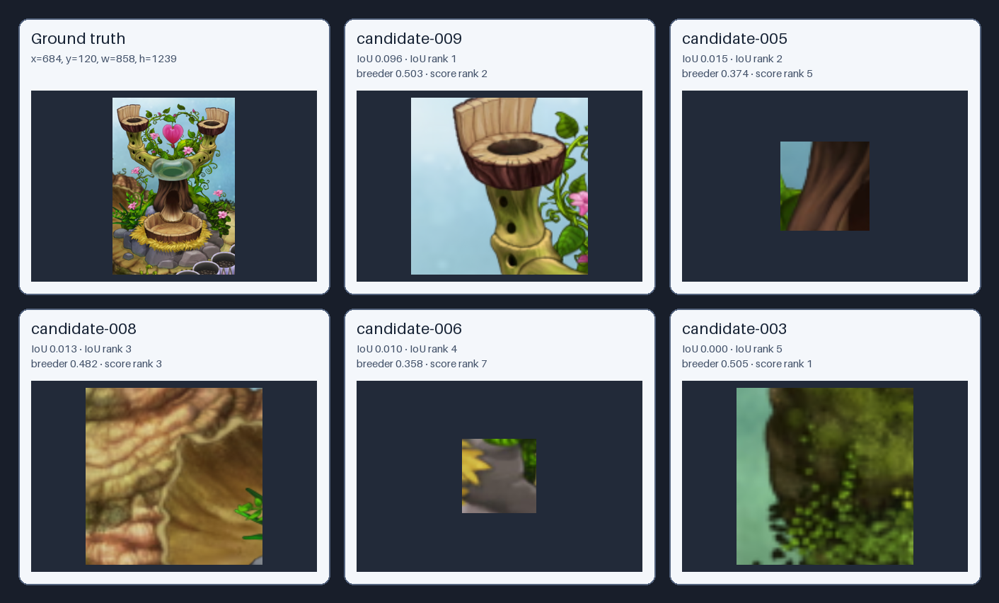
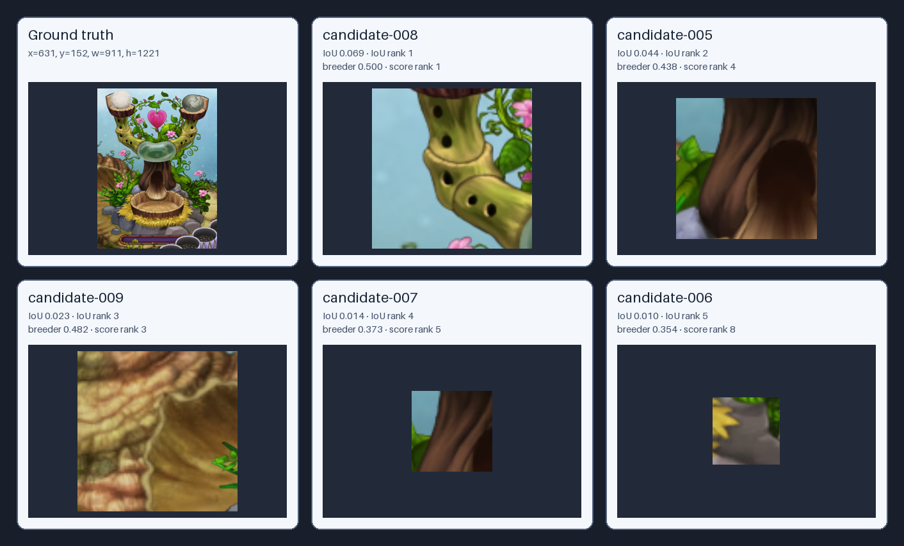

# Breeding Structure Ground-Truth Comparison

Annotation files scanned: **12**  
Confirmed ground-truth boxes compared: **2**  
Skipped pending/unboxed annotations: **10**

Ground-truth coordinates identify the true object in one image. They are supervision for measuring proposal and ranking failures, not future location rules.

| Image | Ground-truth box | Best IoU | Best breeder-likeness candidate | Any overlap | Failure mode | Comparison |
|---|---|---:|---|---|---|---|
| plant-breeding-structure-idle-zoom-01.png | `x=684, y=120, w=858, h=1239` | 0.096 | candidate-003 (0.505) | yes | `missed_proposal` | [contact sheet](plant-breeding-structure-idle-zoom-01/comparison.png) |
| plant-breeding-structure-in-use-zoom-01.png | `x=631, y=152, w=911, h=1221` | 0.069 | candidate-008 (0.500) | yes | `missed_proposal` | [contact sheet](plant-breeding-structure-in-use-zoom-01/comparison.png) |

## plant-breeding-structure-idle-zoom-01.png

Ground truth: `x=684, y=120, w=858, h=1239`  
Best IoU: **0.096**  
Any detector overlap: **yes**  
Failure mode: **missed_proposal**

| IoU rank | Candidate | IoU | Breeder-likeness | Likeness rank | Box |
|---:|---|---:|---:|---:|---|
| 1 | candidate-009 | 0.096 | 0.503 | 2 | `x=633, y=182, w=348, h=348` |
| 2 | candidate-005 | 0.015 | 0.374 | 5 | `x=965, y=721, w=126, h=126` |
| 3 | candidate-008 | 0.013 | 0.482 | 3 | `x=317, y=656, w=405, h=405` |
| 4 | candidate-006 | 0.010 | 0.358 | 7 | `x=1346, y=1039, w=105, h=105` |
| 5 | candidate-003 | 0.000 | 0.505 | 1 | `x=0, y=1123, w=264, h=264` |
| 6 | candidate-001 | 0.000 | 0.377 | 4 | `x=32, y=1139, w=70, h=70` |
| 7 | candidate-002 | 0.000 | 0.371 | 6 | `x=20, y=1124, w=132, h=132` |
| 8 | candidate-004 | 0.000 | 0.287 | 8 | `x=1979, y=570, w=84, h=84` |
| 9 | candidate-007 | 0.000 | 0.279 | 9 | `x=1919, y=493, w=168, h=168` |

## plant-breeding-structure-in-use-zoom-01.png

Ground truth: `x=631, y=152, w=911, h=1221`  
Best IoU: **0.069**  
Any detector overlap: **yes**  
Failure mode: **missed_proposal**

| IoU rank | Candidate | IoU | Breeder-likeness | Likeness rank | Box |
|---:|---|---:|---:|---:|---|
| 1 | candidate-008 | 0.069 | 0.500 | 1 | `x=679, y=357, w=278, h=278` |
| 2 | candidate-005 | 0.044 | 0.438 | 4 | `x=913, y=714, w=220, h=220` |
| 3 | candidate-009 | 0.023 | 0.482 | 3 | `x=296, y=667, w=405, h=405` |
| 4 | candidate-007 | 0.014 | 0.373 | 5 | `x=944, y=730, w=126, h=126` |
| 5 | candidate-006 | 0.010 | 0.354 | 8 | `x=1324, y=1050, w=105, h=105` |
| 6 | candidate-003 | 0.000 | 0.490 | 2 | `x=0, y=1201, w=176, h=176` |
| 7 | candidate-002 | 0.000 | 0.372 | 6 | `x=6, y=1140, w=88, h=88` |
| 8 | candidate-001 | 0.000 | 0.362 | 7 | `x=4, y=1028, w=70, h=70` |
| 9 | candidate-004 | 0.000 | 0.335 | 9 | `x=464, y=811, w=84, h=84` |
