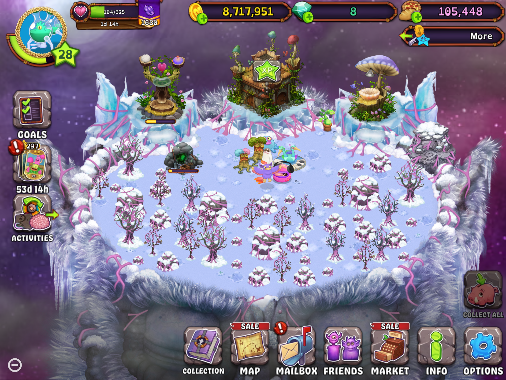

# Breeder Result Guess

## Source

Island: **Mirror Cold Island**  
Island alias: **Mirror Cold Island -> Cold Island**  
Detection mode: **detect-breeders**  

Source image: `/Users/broen/Documents/Git/msm-cognition/training/screenshots/2026-07-09-world-overview-mirror-cold-island.png`



## Detector candidates

Active filters: locked templates excluded, Paironormal templates excluded, minimum size `144x144`, match threshold `0.760`.

Active templates: `enhanced-breeding-structure.webp, normal-breeding-structure.webp`

Rejected detector checks:

| Reason | Count |
|---|---:|
| paironormal_template_excluded | 48 |
| locked_template_excluded | 13 |
| below_min_size | 4 |
| below_threshold | 25 |

No Breeding Structure candidates met the current template filters, size guards, and threshold.

## Recognition notes

- When a Breeding Structure is in progress, the top-left and top-right eggs are the parent eggs.
- When a Breeding Structure is finished, the bottom-center egg is the resulting egg.
- Parent egg crop regions are currently heuristic and should be tuned from confirmed training examples.
- Automated egg-reference matching is a simple helper, not a trained recognizer and not authoritative.
- Manual parent recognition, when supplied, is displayed separately from automated matches.

## Training review

Suggested `detector_classification` values: `confirmed_positive`, `false_positive`, `missed_detection`, `parent_crop_incorrect`, `parent_crop_correct`, `unresolved`.

```yaml
training_review:
  status: unresolved
  detector_candidate_correct: null
  detector_classification: null
  breeder_box_correction: null
  left_parent_crop_correct: null
  left_parent_box_correction: null
  right_parent_crop_correct: null
  right_parent_box_correction: null
  confirmed_left_parent: null
  confirmed_right_parent: null
  confirmed_result: null
  notes: null
```
